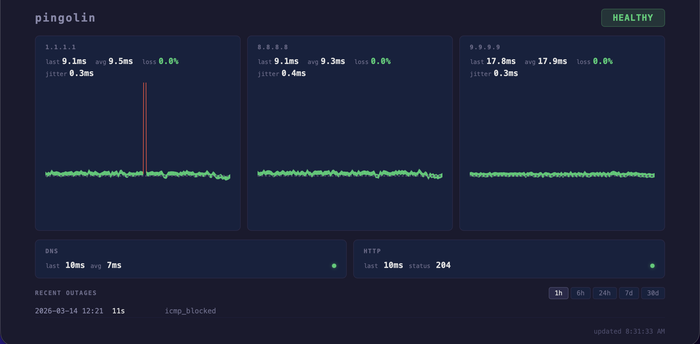

<p align="center">
  
</p>

[](https://goreportcard.com/report/github.com/fabioconcina/pingolin)
[](https://github.com/fabioconcina/pingolin/releases/latest)
[](go.mod)
[](LICENSE)

# pingolin

Internet connection health monitor — run it, see what's going on.

## Install

```
go install github.com/fabioconcina/pingolin@latest
```

## Usage

```
pingolin              # launch TUI with live monitoring
pingolin daemon       # run as background service
pingolin web          # start web dashboard (browser)
pingolin status       # quick one-shot health check
pingolin history      # show stats for last 24h
pingolin export       # export data as CSV or JSON
pingolin mcp          # run as MCP server (stdio)
```

## What it monitors

- ICMP latency and packet loss to multiple targets (1.1.1.1, 8.8.8.8, 9.9.9.9)
- DNS resolution time (system resolver + 1.1.1.1)
- HTTP connectivity (Google generate_204)
- Jitter calculation over sliding window
- Outage detection with historical logging and cause classification

## Web dashboard

<p align="center">
  
</p>

```
pingolin web [--listen 0.0.0.0:8080]
```

Starts an HTTP server with a live dashboard. The page uses Server-Sent Events (SSE) to update every 2 seconds — no manual refresh needed. Designed for always-on displays (tablets, wall monitors).

The dashboard shows the same data as the TUI: per-target latency sparklines, packet loss, DNS and HTTP status, and recent outages. Time range is selectable from the browser.

If no daemon is running, the web server starts its own embedded prober automatically.

Configuration in `config.toml`:

```toml
[web]
listen = "0.0.0.0"
port = 8080
```

## AI integration

### MCP server (Model Context Protocol)

```
pingolin mcp
```

Runs an MCP server on stdio, exposing a `check_connection` tool. AI agents (Claude Desktop, Claude Code) can query connection health directly.

Claude Desktop configuration:

```json
{
  "mcpServers": {
    "pingolin": {
      "command": "/path/to/pingolin",
      "args": ["mcp"]
    }
  }
}
```

### JSON export

```
pingolin export --format json
```

Returns structured JSON to stdout. Pipe to any tool:

```
pingolin export --format json | jq '.pings[] | select(.packet_loss == true)'
```

### Exit codes

- 0: success
- 1: error (config load failure, database error, I/O error)
- 2: connection unhealthy (status command only — at least one probe failing)

## Running as a service

pingolin monitors continuously — to collect data 24/7, run it as a systemd service:

```
sudo pingolin service install
```

This installs two systemd services:

- `pingolin.service` — background daemon that runs ICMP/DNS/HTTP probes and writes to the database. Granted `CAP_NET_RAW` for ICMP via `AmbientCapabilities`.
- `pingolin-web.service` — web dashboard on port 8080, reads from the same database. Starts after the daemon.

It also creates a sudoers drop-in (`/etc/sudoers.d/pingolin`) so you can restart both services without a password — required for remote deploys.

The TUI and web dashboard auto-detect a running daemon and skip starting their own prober.

```
sudo pingolin service status      # check both services
sudo pingolin service logs        # view recent logs
sudo pingolin service uninstall   # stop and remove everything
```

For manual use without systemd, ICMP requires `CAP_NET_RAW`:

```
sudo setcap cap_net_raw+ep /path/to/pingolin
```

## Deploying

From your development machine:

```
make deploy
```

This runs tests, cross-compiles for linux/amd64, uploads the binary to the server, and restarts both services. Requires the one-time `sudo pingolin service install` on the server (sets up passwordless systemctl).

Edit `DEPLOY_HOST` and `DEPLOY_PATH` in the Makefile to match your server.

## Configuration

Copy `config.toml.example` to `~/.config/pingolin/config.toml` and edit as needed.
CLI flags override config file values.

```
--config PATH        Config file path
--db PATH            Database path
--ping-interval 5s   ICMP probe interval
--dns-interval 30s   DNS probe interval
--http-interval 30s  HTTP probe interval
--targets 1.1.1.1,8.8.8.8  Comma-separated ICMP targets
--retention 30d      Data retention period
--verbose            Debug logging
```

## License

MIT
